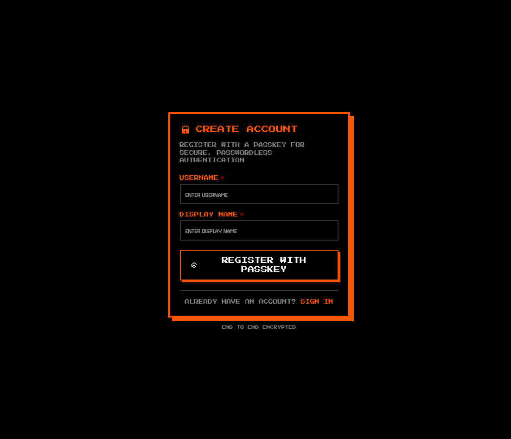
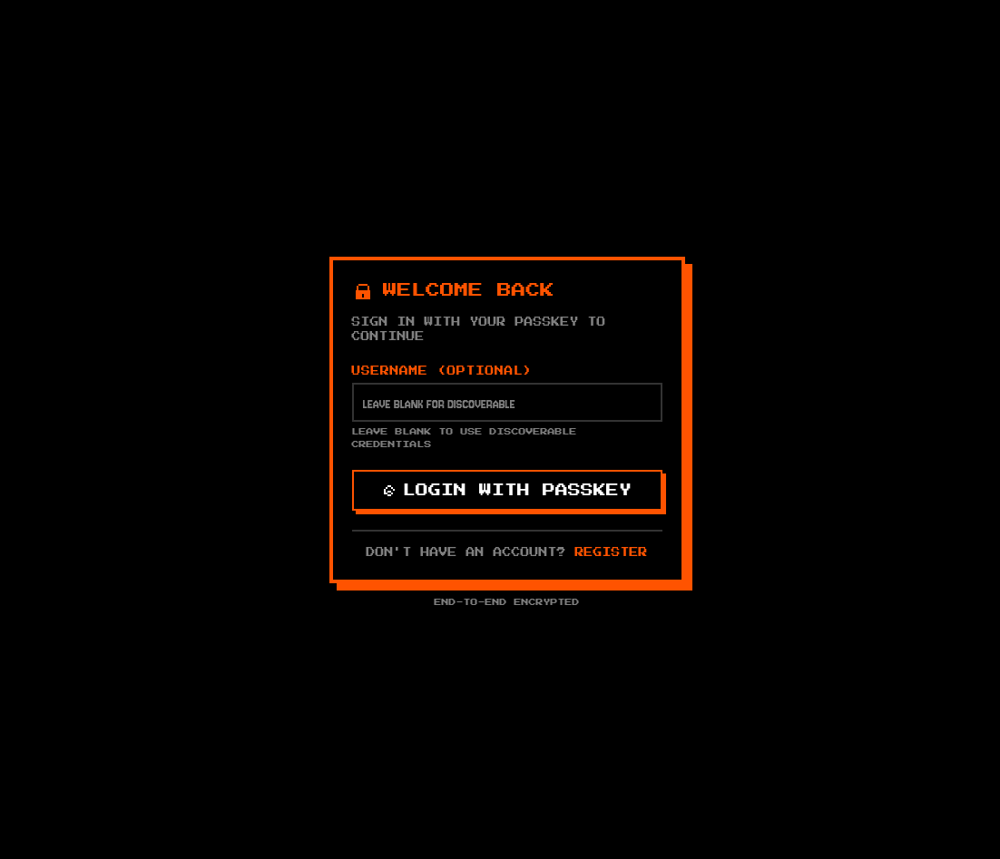
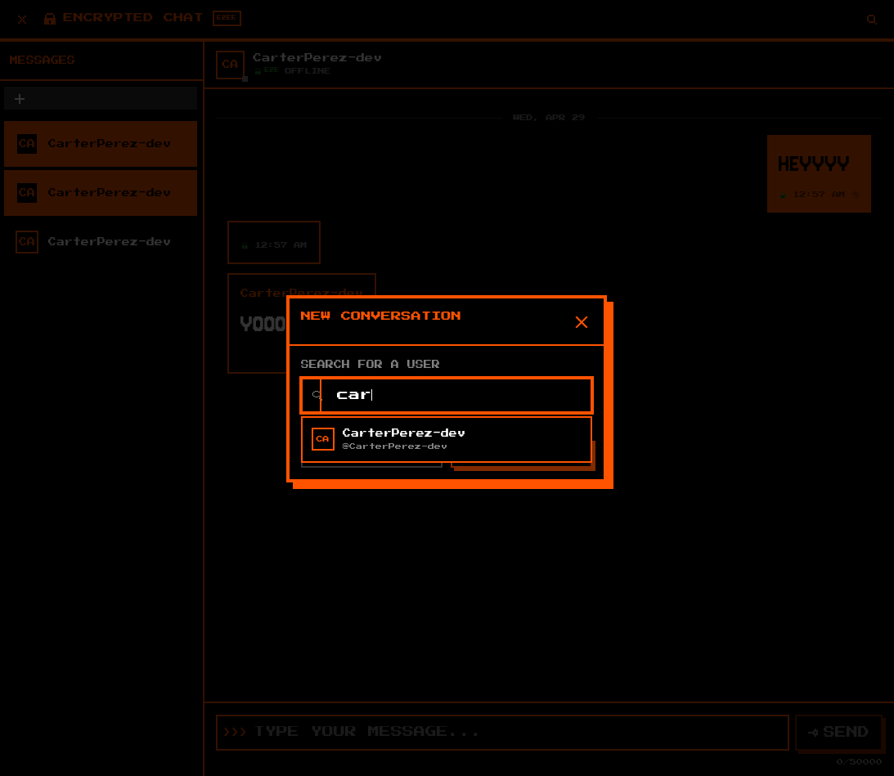
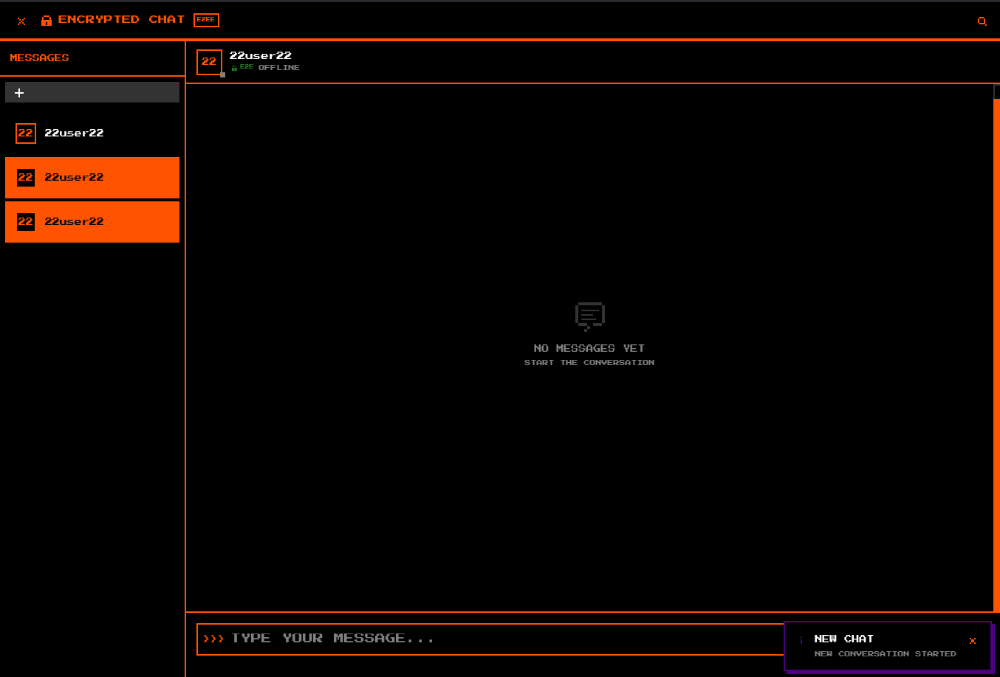
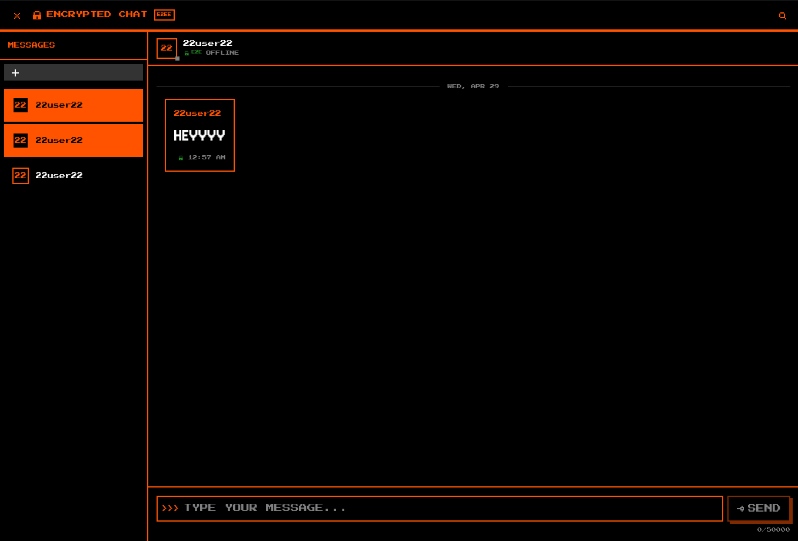
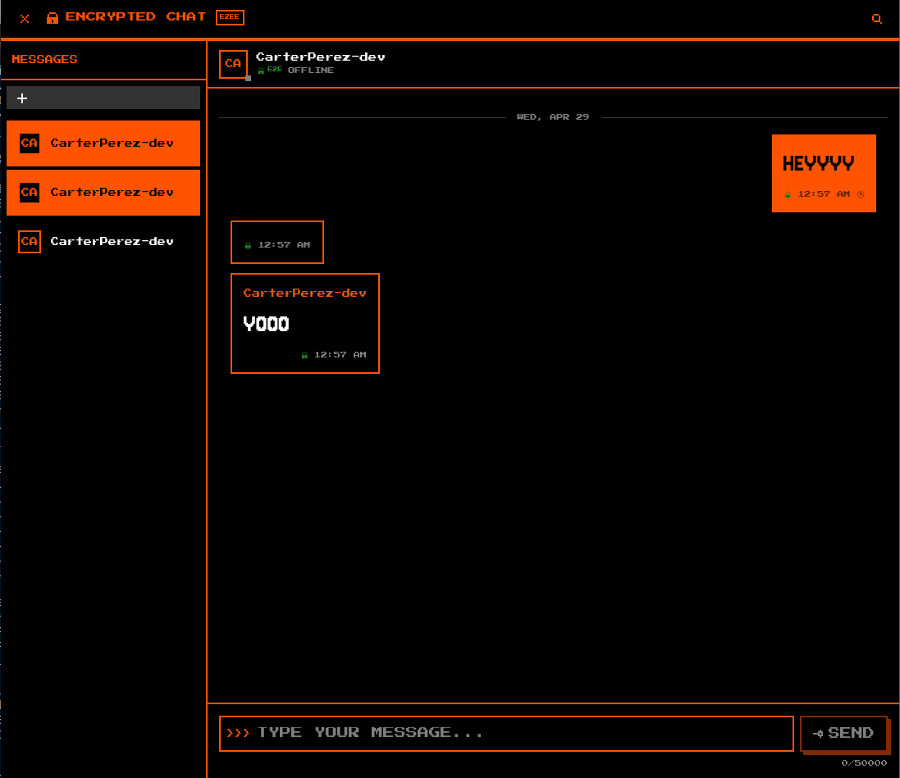
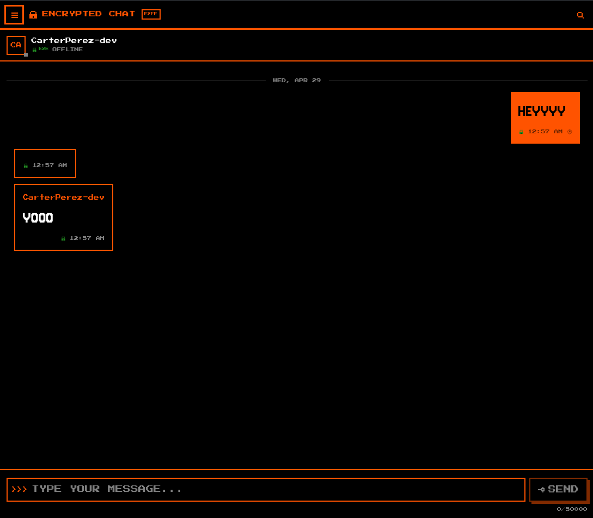

<!-- ©AngelaMos | 2026 -->
<!-- DEMO.md -->

<div align="center">

```ruby
███████╗███╗   ██╗ ██████╗██████╗ ██╗   ██╗██████╗ ████████╗███████╗██████╗
██╔════╝████╗  ██║██╔════╝██╔══██╗╚██╗ ██╔╝██╔══██╗╚══██╔══╝██╔════╝██╔══██╗
█████╗  ██╔██╗ ██║██║     ██████╔╝ ╚████╔╝ ██████╔╝   ██║   █████╗  ██║  ██║
██╔══╝  ██║╚██╗██║██║     ██╔══██╗  ╚██╔╝  ██╔═══╝    ██║   ██╔══╝  ██║  ██║
███████╗██║ ╚████║╚██████╗██║  ██║   ██║   ██║        ██║   ███████╗██████╔╝
╚══════╝╚═╝  ╚═══╝ ╚═════╝╚═╝  ╚═╝   ╚═╝   ╚═╝        ╚═╝   ╚══════╝╚═════╝
```

**Demo & Preview**

<br>

<a href="https://chat.carterperez-dev.com">
  
</a>

<br>

```ruby
docker compose up -d    →    https://localhost
```

<br>

[Register](#register) · [Login](#login) · [New Conversation](#new-conversation) · [Empty Conversation](#empty-conversation) · [First Message](#first-message) · [Encrypted Messaging](#encrypted-messaging) · [Mobile View](#mobile-view)

</div>

---

### Register

Passwordless account creation with WebAuthn passkey enrollment — username and display name are the only fields, no password is ever entered or stored



---

### Login

Passkey authentication with optional username field — leave blank to use a discoverable credential resolved by the authenticator



---

### New Conversation

Username search resolves the recipient's identity key from the directory before any message is composed



---

### Empty Conversation

Fresh thread with E2EE badge and presence indicator — no plaintext history is ever stored on the server, so a new conversation truly starts empty



---

### First Message

Outbound message encrypted client-side with the recipient's public key and pushed over WebSocket — the server only ever sees ciphertext



---

### Encrypted Messaging

Live two-way conversation with delivery timestamps and the lock indicator on every bubble confirming end-to-end encryption per message



---

### Mobile View

Responsive single-pane layout with collapsible sidebar — passkey auth and E2EE work identically on mobile via the platform authenticator


